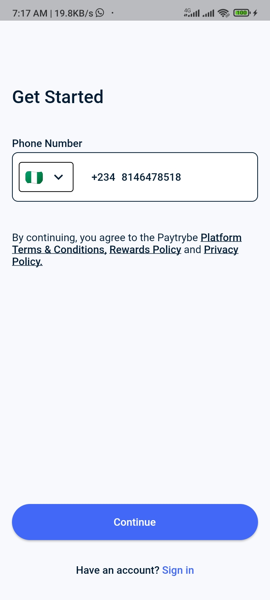
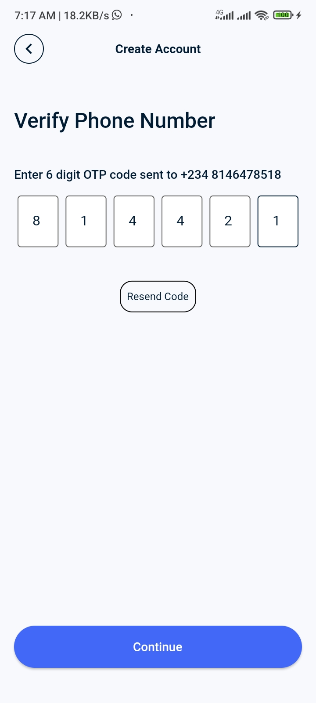
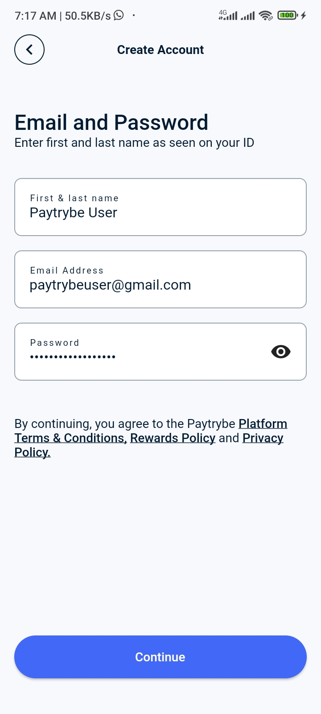

# Payment App Auth UI

A flutter project that depicts a simple auth flow for a payment app

## Description

The Payment App Authentication UI provides a sleek and modern interface for user authentication in
payment apps. The project uses Flutter, which is a popular open-source mobile application
development framework that allows developers to build high-quality, cross-platform mobile
applications for iOS and Android.

## Features

- User-friendly create account screen with name, email and password fields.
- Form validation for all fields to ensure accurate user input.
- Well-structured codebase that is easy to understand and maintain.

## Screenshot







## Installation

Clone the repository from Github:

``` bash
git clone https://github.com/logickoder/payment_app_auth_ui.git
```

Navigate to the project directory:

``` bash
cd payment_app_auth_ui
```

Run the app on your emulator or physical device:

```arduino
flutter run
```

## Requirements

Flutter installed on your system
Emulator or physical device for testing

## Contributing

Contributions are welcome! Please feel free to fork the repository and submit pull requests. Make
sure to follow the existing code conventions and try to include tests with your changes.

## License

This project is licensed under the MIT License - see the LICENSE.md file for details.